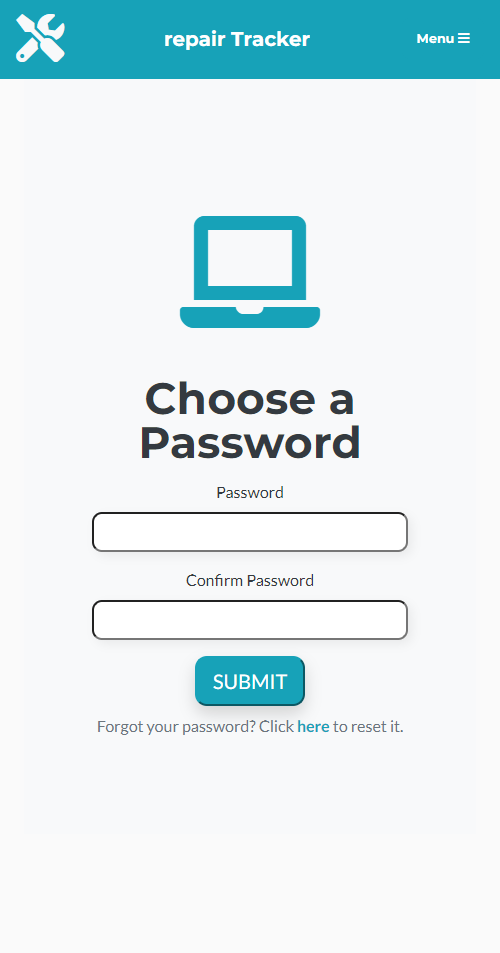

# repairTracker

## Description

repairTracker is a full-stack application using Node.js, Express, MySQL, Sequelize, Passport, Express-Handlebars, JQuery and Bootstrap. 

This demonstrates full usage of C-R-U-D in a realistic scenario by tracking a repair based on five different statuses (received, in progress, waiting on parts, complete, paid) as one would in an automobile, electronics, appliance or other repair shop. 

Repair techs can log into the Employees section with a valid login (provided by the company's administrator) to manage order status, add photos, view work notes, and update either as needed. Technicians can also generate a printable or .pdf invoice for each work order.  

Administrators are able to create new users and delete orders from the database. Managers can also delete orders.

Customers can view the Tracker page to lookup the current status of their order. 

repairTracker is intended for use on an iPad in a mobile setting, but is responsive to all screen sizes. 

## LOGIN CREDENTIALS: TECHNICIAN: Username:Tech2@company.com / Password: Technician2 (case sesitive)
Deployed Site: https://repairtracker.herokuapp.com/

FUTURE UPDATES: 
- Integration with CarMD or similar API for detailed maintenance time/cost estimations, VIN decoder and Technical Service Bulletins

- Assign different repairs to different Techs, and restrict access to repair orders assigned to them
- Marking an order paid will take in the price paid and log it for daily/weekly/yearly totals and averages 

## Table of Contents

* [Installation](#installation)
* [Usage](#usage)

## Installation

Simply clone the repo, and/or visit the deployed page link to begin.

## Usage
 
 
 
 

## Questions

Contact [Nlamonaco86](mailto:nlamonaco86@gmail.com) with any questions or suggestions!
