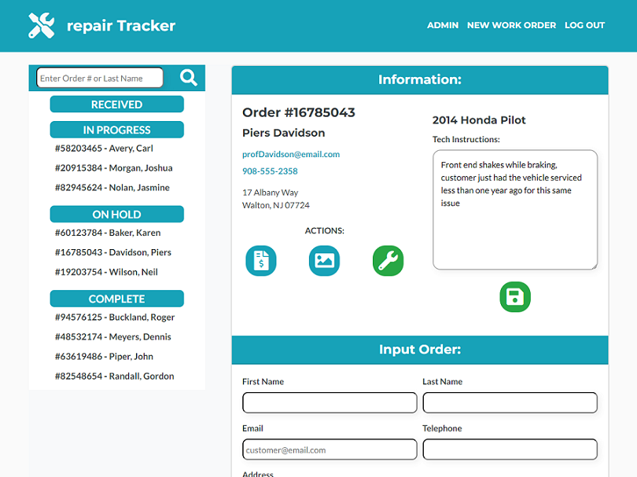
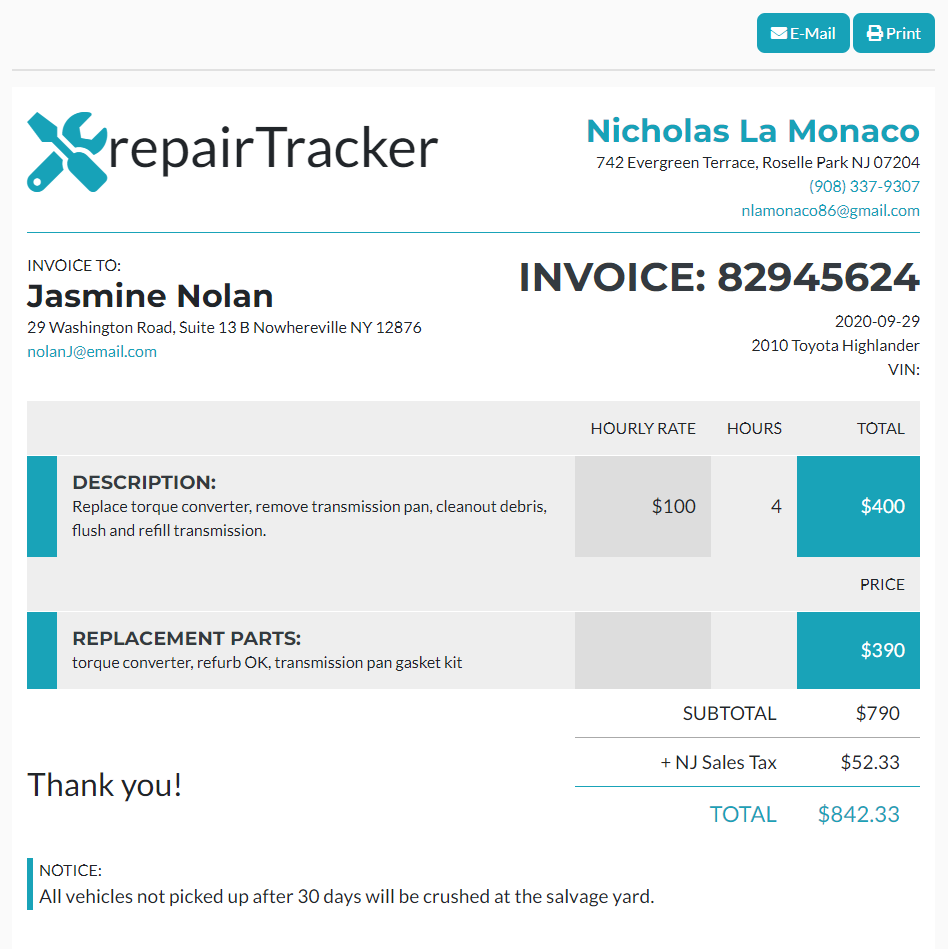

# repairTracker

repairTracker is a full-stack application using Node.js, Express, MySQL, Sequelize, Passport, Express-Handlebars, JQuery and Bootstrap. 

This demonstrates full usage of C-R-U-D in a realistic scenario by tracking a repair based on five different statuses (received, in progress, waiting on parts, complete, paid) as one would in an automobile, electronics, appliance or other repair shop. 

# Features:

## Complete User Authentication System

The server automatically creates an Administrator account on the first startup, which can then be user to create user (employee, manager, etc.) accounts.

DEMO Employee Account: Tech2@company.com / Password: Technician2 (case sesitive)

Anyone can create a Customer account as well, but only access customer sections of the app. 

All users are able to reset their password with a temporary code sent to their e-mail, and will be prompted to make a new password on their next login.

## Track and Manage Repair Order Statuses

Repair techs can log into the Employees section to create work orders, manage work order statuses, add photos, as well as view and edit work notes. 

## Complete Invoice system

Technicians can also generate a printable or .pdf invoice for each work order. The invoice calculates labor and parts costs, as well as local sales tax. 

## Customer Portal

Customers can view the Tracker page to lookup the current status of their order, with or without an account, as well as retrieve their invoice. 

repairTracker is intended for use on an iPad in a mobile setting, but is responsive to all screen sizes. 

## Deployed Site: https://repairtracker.herokuapp.com/
## Username:Tech2@company.com / Password: Technician2 (case sesitive)
This account can be used to test the application on Heroku. 


FUTURE UPDATES: 
- Customer Portal and front-end functions to view more data. 
- Assign different repairs to different Techs, and restrict access to repair orders assigned to them
- Marking an order paid will take in the price paid and log it for daily/weekly/yearly totals and averages 

## Table of Contents

* [Installation](#installation)
* [Usage](#usage)

## Installation

Once you've cloned the repo, you'll need to make sure the following environment variabels are set:

```
MYSQL_USERNAME
MYSQL_PASSWORD
```

Next, open mySQL Workbench and "CREATE DATABASE repair_db;"

Afterwards, create a file ".env" in the root directory. Inside this file, you'll need to set the following environment variables:

```
ADMIN_PASSWORD=yourPassword1
```
Admin password must contain a Capital letter and at least one number. The first time the application runs, it will automatically create an administrator account if one doesn't exist. This password MUST be set before running the app. Once you log in as the administrator, you can then create other other accounts on the admin page. 

The .env file should also include:
```
CLOUDINARY_CLOUDNAME=yourCloudnameHere
CLOUDINARY_UPLOAD_PRESET=yourUploadPresetHere

EMAIL_SERVICE=serviceName
EMAIL_USERNAME=yourName@email.com
EMAIL_PASSWORD=yourPassword
```

Cloudinary requires an account at Cloudinary, if you omit this step the app will run but the image features won't work. Likewise if if there is no environment variables for email set, the e-mail features will not work. Note that gmail and other providers may require you to enable "less secure" options in order to work with Nodemailer - consider using a spare or temporary email for this purpose. 

## Usage
 
 
 
 

## Questions

Contact [Nlamonaco86](mailto:nlamonaco86@gmail.com) with any questions or suggestions!
