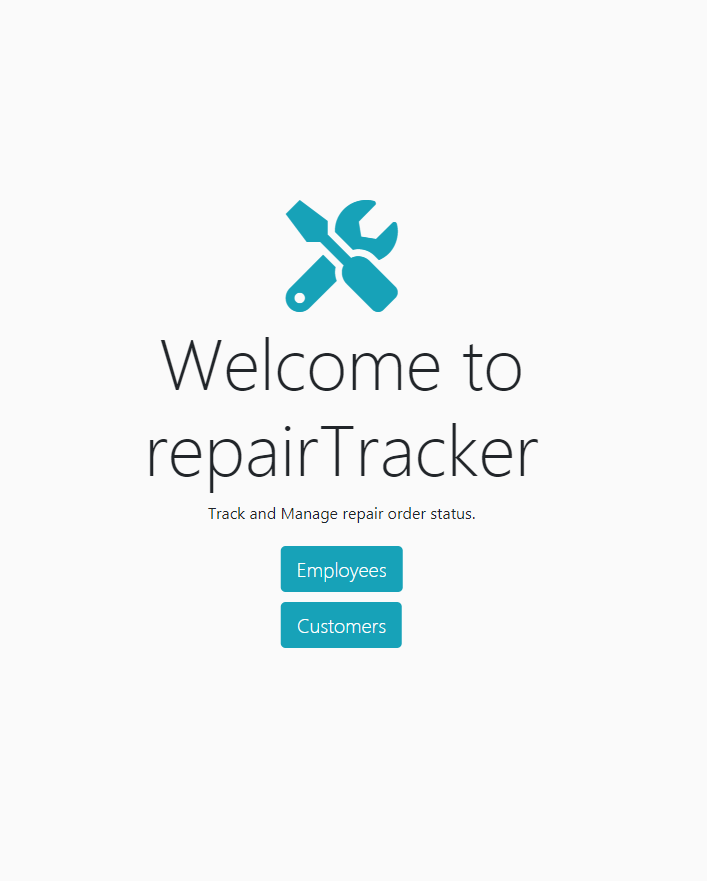
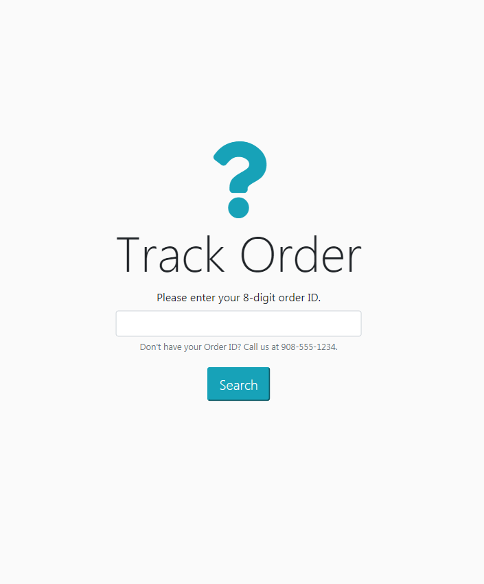

# repairTracker

## Description

repairTracker is a full-stack application using Node.js, Express, MySQL, Sequelize, Passport, Handlebars, JQuery and Bootstrap. 

This demonstrates full usage of C-R-U-D in a realistic scenario by tracking a repair based on four different statuses (received, in progress, waiting on parts, complete) as one would in an automobile, electronics, appliance or other repair shop. Repair techs can log into the Employees section with a valid login (provided by the company's administrator) and customers can view the Tracker page to lookup the current status of their order. 

repairTracker is intended for use on an iPad in a mobile setting, but is responsive to all screen sizes. 

## LOGIN CREDENTIALS: Username: Admin@CompanyAdmin.com / Password: Admin1 (case sesitive)
Deployed Site: https://repairtracker.herokuapp.com/

FUTURE UPDATES: 
- Admin/Tech will be able to add or edit notes when viewing the Issue modal
- Assign different repairs to different Techs, and restrict access to repair orders assigned to them
- Marking an order paid will take in the price paid and log it for daily/weekly/yearly totals and averages 

## Table of Contents

* [Installation](#installation)
* [Usage](#usage)

## Installation

Simply clone the repo, and/or visit the deployed page link to begin.

## Usage
 
 
 

## Questions

Contact [Nlamonaco86](mailto:nlamonaco86@gmail.com) with any questions or suggestions!
