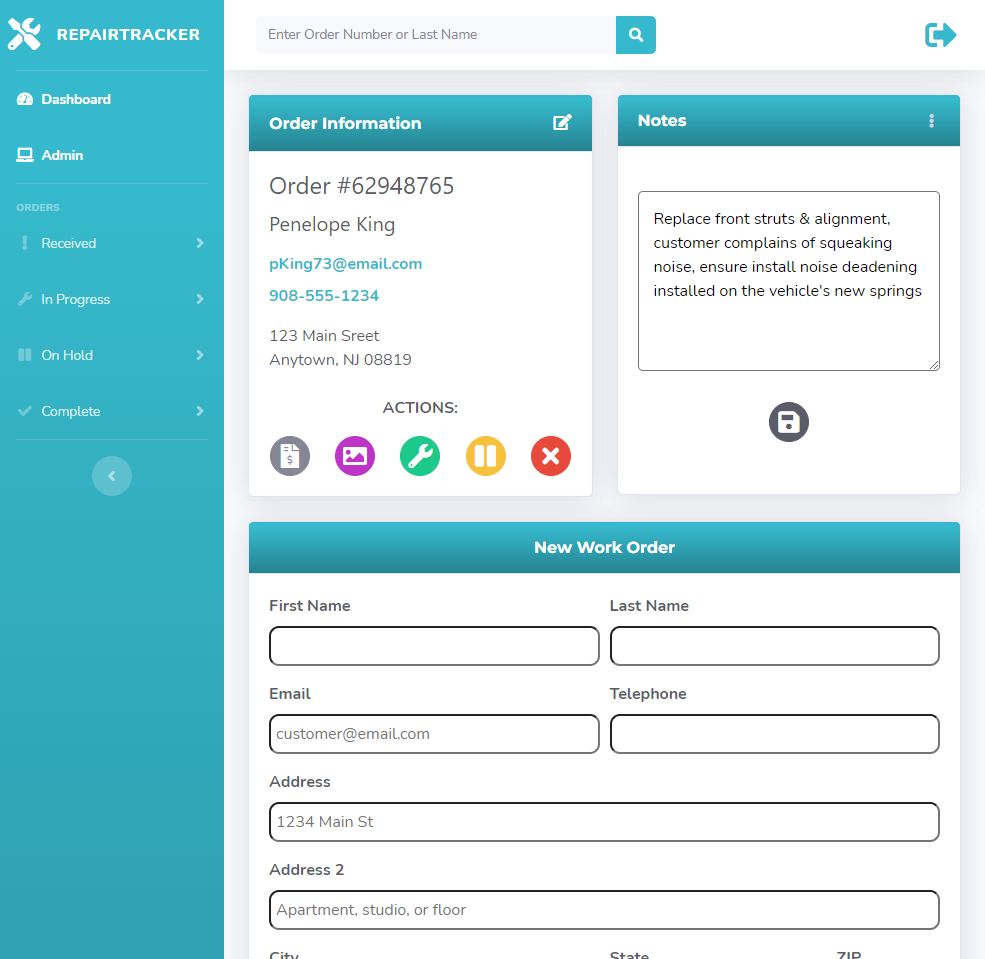
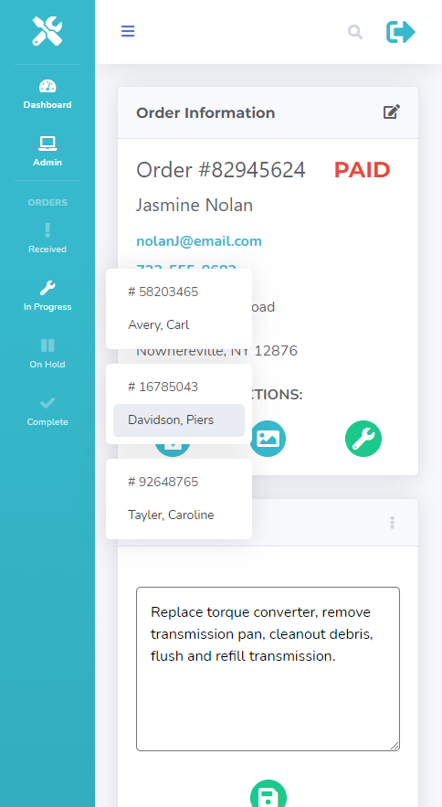
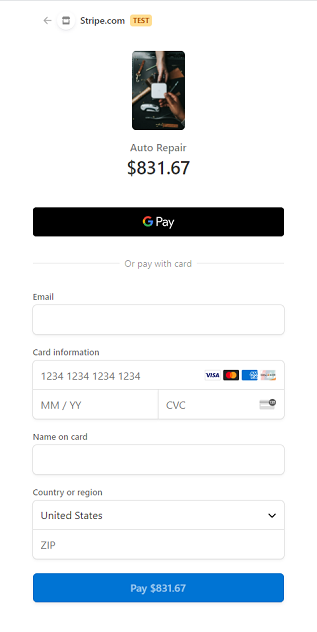
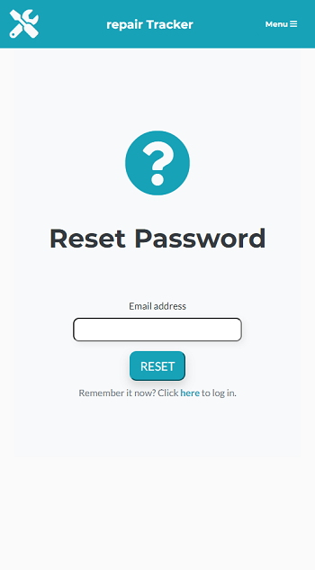
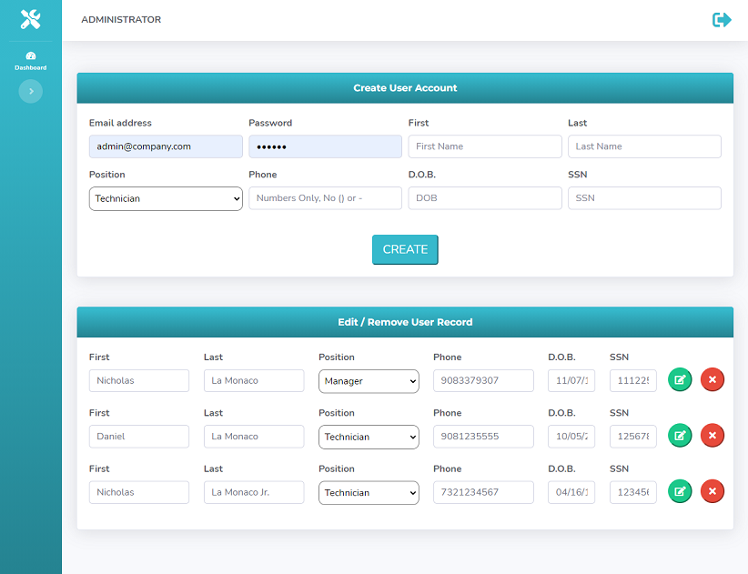

# repairTracker

repair Tracker is a convenient, easy to use, invoice management and point of sale system for businesses and customers.

This full-stack application uses Node.js, Express, MySQL, Sequelize, Passport, Express-Handlebars, and Bootstrap, and packages such as Twilio, Stripe, Nodemailer, Cloudinary, dotenv and more provide supporting features.

The UI and database are themed towards auto repair, but can quickly be refactored to suit the needs of virtually any industry, such as appliance or electronics repair shops, food delivery services, and much more. 

# Features:

## Complete User Authentication System

The server automatically creates an Administrator account on the first startup, which can then be user to create employee, manager, etc. accounts for different levels of employee access to sections of the platform.

Anyone can create a Customer account as well, but can only access the customer sections of the app with it. 

All users are able to reset their password with a temporary code sent to their e-mail or via SMS, and will be prompted to make a new password on their next login.

The Administrator account is able to edit or delete employee or customer user information through the admin control panel. 

## Complete Invoice & Point-of-Sale System

Technicians can generate a printable or .pdf invoice for each work order. The invoice calculates labor and parts costs, as well as local sales tax, and displays all the information in a customer-friendly manner. 

Customers can pay for the balance of their invoice, either in person or remotely, using their credit card or Apple/Google Pay via integration with Stripe. Full integration with Stripe marks orders in the database as paid, so Technicians are able to see if an invoice is paid or not. 

## Track and Manage Repair Order Statuses

Repair techs can create new work orders for customers along with cloud uploaded images, notes, and industry-specific data related to the work order. 

Techs can manage the status of current work orders through the dashboard, as well as view and edit the work notes or customer information related to the order from that same menu. 
 
Intuitive database/server design ensures that duplicate customer records are not created, rather multiple orders associate to the same customer and their contact information is automatically updated to reflect their most recent information provided.

## Customer Portal

Customers can view the Tracker page to lookup the current status of their order, with or without an account, and view their invoice, from the customer portal.  

repairTracker is intended for use on an iPad in a mobile setting, but is responsive to all screen sizes. 

## Deployed Site: https://repairtracker.herokuapp.com/
```
Username:Tech2@company.com / Password: Technician2 (case sesitive)
```
This account can be used to test the application on Heroku. 

FUTURE UPDATES: 
- Improved Customer Portal and front-end functions to view more data. 
- Assign different repairs to different Techs, and restrict access to repair orders assigned to them
- Financial graphs for daily/weekly/monthly/etc. payment totals 

## Table of Contents

* [Installation](#installation)
* [Usage](#usage)

## Installation

Once you've cloned the repo, you'll need to make sure the following environment variables are set:

```
MYSQL_USERNAME
MYSQL_PASSWORD
```

Next, open mySQL Workbench and "CREATE DATABASE repair_db;"

Afterwards, create a file ".env" in the root directory. Inside this file, you'll need to set the following environment variables:

```
ADMIN_PASSWORD=yourPassword1
```
Password must contain a Capital letter and at least one number. The first time the application runs, it will automatically create an administrator account if one doesn't exist. This password MUST be set before running the app. Once you log in as the administrator, you can then create other other accounts on the admin page.

The .env file should also include:
```
CLOUDINARY_CLOUDNAME=yourCloudnameHere
CLOUDINARY_UPLOAD_PRESET=yourUploadPresetHere

EMAIL_SERVICE=serviceName
EMAIL_USERNAME=yourName@email.com
EMAIL_PASSWORD=yourPassword
```

You'll need a Twilio account and the following environment variables:
```
ACCOUNT_SID=yourAccountSID
AUTH_TOKEN=yourAuthToken
PHONE_NUMBER=yourPhoneNumber
```

Cloudinary requires an account at Cloudinary, if you omit this step the app will run but the image features won't work. Likewise if if there is no environment variables for email set, the e-mail features will not work. Note that gmail and other providers may require you to enable "less secure" options in order to work with Nodemailer - consider using a spare or temporary email for this purpose. 

## Usage
 
 
 
 
 
 
 

## Questions

Contact [Nlamonaco86](mailto:nlamonaco86@gmail.com) with any questions or suggestions!
