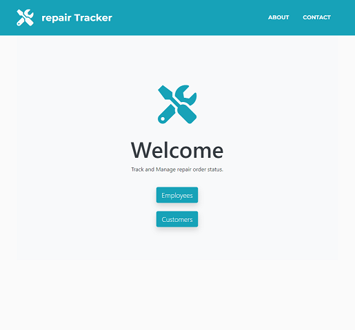
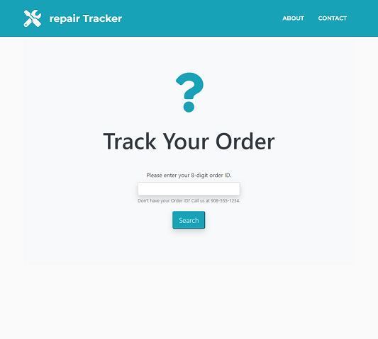

# repairTracker

## Description

repairTracker is a full-stack application using Node.js, Express, Sequelize, Passport, Handlebars, JQuery and Bootstrap. 

This demonstrates full usage of C-R-U-D in a realistic scenario by tracking a repair based on four different statuses (received, in progress, waiting on parts, complete) as one would in an automobile, electronics, appliance or other repair shop. Repair techs can log into the Employees section with a valid login (provided by the company's administrator) and customers can view the Tracker page. 

LOGIN CREDENTIALS: Username: "Admin@repairTracker.com" / Password: "Admin1" (case sesitive)

Deployed Site: https://repairtracker.herokuapp.com/

FUTURE UPDATES: 
- Industry-specific variable tracking (i.e. make/model/year/serial)
- Users will be able to look up the current status of their order from a separate page
- Admin/Tech will be able to edit notes on order status change
- Marking an order paid will take in the price paid and log it for daily/weekly/yearly totals and averages 

## Table of Contents

* [Installation](#installation)
* [Usage](#usage)

## Installation

Simply clone the repo, and/or visit the deployed page link to begin.

## Usage
 
 
 

## Questions

Contact [Nlamonaco86](mailto:nlamonaco86@gmail.com) with any questions or suggestions!
